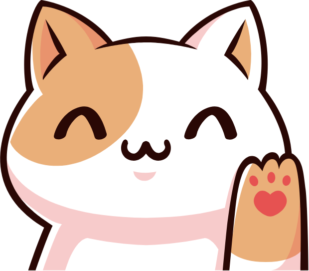
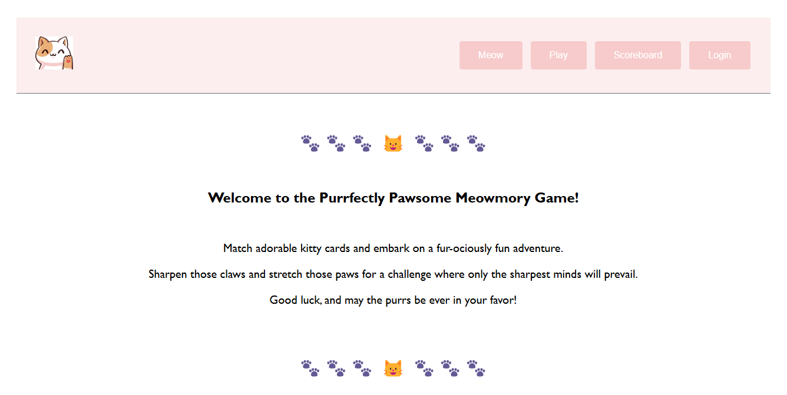
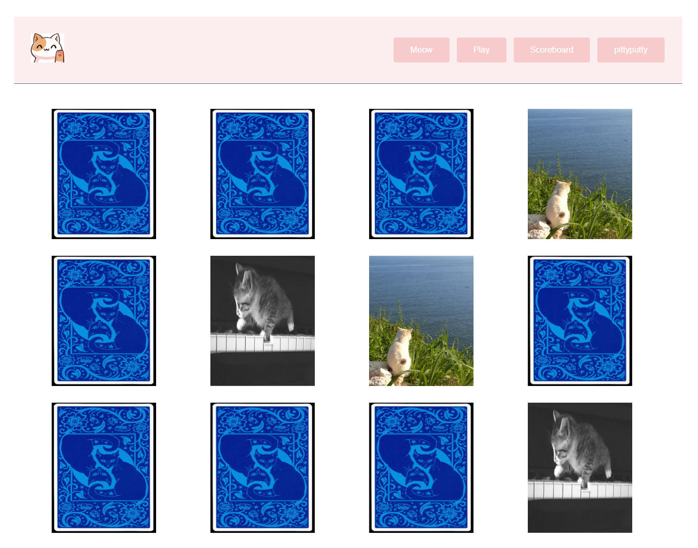

<!-- PROJECT LOGO -->
<br />
<div align="center">
  <a>
    
  </a>
<h1 align="center">Meowmory Game</h1>

  <p align="center">
    Match adorable kitty cards and embark on a fur-ociously fun adventure! Register, log in and play to gain score and advance on the Scoreboard.
</p>
</div>

<!-- TABLE OF CONTENTS -->
<details>
  <summary>Table of Contents</summary>
  <ol>
    <li>
      <a href="#about-the-project">About The Project</a>
      <ul>
        <li><a href="#built-with">Built With</a></li>
      </ul>
    </li>
    <li><a href="#contributors">Contributors</a></li>
    <li>
      <a href="#getting-started">Getting Started</a>
      <ul>
        <li><a href="#prerequisites">Prerequisites</a></li>
        <li><a href="#installation">Installation</a></li>
      </ul>
    </li>
    <li><a href="#usage">Usage</a></li>
    <li><a href="#stopping the containers">Stopping the App</a></li>
    <li><a href="#troubleshooting">Troubleshooting</a></li>
    <li><a href="#roadmap">Roadmap</a></li>
  </ol>
</details>

<!-- ABOUT THE PROJECT -->
## About The Project
The Meowmory Game is a fun, cat-themed memory game. You can play and registered users can even gain score if playing while logged in. Turn the volume on for the full experience (caution: dogs might get upset).
The Meowmory Game is a MERN stack project built with MongoDB database and a Vite React frontend.
Hope you have fun with it!  

### Built With
- Backend:   
  [![Express][Express.js]][Express-url]
  [![Node.js (v21.4.0)][Node.js]][Node.js-url]
- Database:  
  [![MongoDB][MongoDB]][MongoDB-url]
- Frontend:  
  [![React][React.js]][React-url]
  [![Vite][Vite]][Vite-url]
  [![CSS3][CSS3]]  
  
### Contributors:

- **Molnár Marianna**   
    GitHub: https://github.com/MariannaMolnar  
    [![LinkedIn][linkedin-shield]][linkedin-url-m]
- **Szatyina Alexa**
    GitHub: https://github.com/szatyinalexa  
    [![LinkedIn][linkedin-shield]][linkedin-url-a]
- **Oláhné Klár Erika**    
    GitHub: https://github.com/o-k-e  
    [![LinkedIn][linkedin-shield]][linkedin-url-e]


<!-- GETTING STARTED -->
## Getting Started

This is an example of how you may give instructions on setting up your project locally.
To get a local copy up and running follow these simple example steps.

### Prerequisites

Before running the project, ensure you have the following installed:
- Node.js (v21.4.0) – [Download][Node.js-url]
- MongoDB Atlas account – [Sign up][MongoDB-url]

Here you find the steps of the installation of our project:
1. Clone the repository
    ```
    git clone https://github.com/CodecoolGlobal/freestyle-mern-project-2-react-szatyinalexa.git
    cd freestyle-mern-project-2-react-szatyinalexa
    ```

2. Configure Environment Variables

   To set up your environment variables, simply copy and rename the `.env.example` files to `.env` in the server and client directories. You can do this using the following terminal command:

    ```bash
    cp .env.example .env
    ```

   Once copied, open the `.env` files and update the values to match your credentials and environment settings. For example:

   /server/.env
   ```plaintext
   DATABASE_URL="your_mongodb_connection_string"
   ```

   /client/.env
   ```plaintext
   VITE_CAT_API_KEY="your_cat_api_key"
   ```

   Make sure that the credentials you provide are secure and appropriate for your environment and to get your API key from The Cat API - [Get you API key][CatAPI-url].

3. Running the Project

    Seed the database by running seed.js:
    ```
    cd server
    node seed.js
    ```

    Start the server by entering in your terminal the following command:
    ````
    cd server
    npm start
    ````

    Start the frontend with the following command:
    ````
    cd client
    npm run dev
    ````

   These commands will:
    - Build and start the MongoDB database with inital data.
    - Start the server.
    - Start the Vite React frontend.

   Now, your frontend should be running at:
🔗 http://localhost:5173 (default Vite port)

   Your backend should be running at:
🔗 http://localhost:3000 (default Express port)

   The services will be available at:
🔗 http://localhost:5173


### Usage

Once the services are running, you can access the frontend to interact with the application and the backend API for examining purposes.

You can play without registering or logging in, but you are only able to gain scores if you play while logged in. Once you have a profile, you can change your password, advance in the scoreboard if keep playing and you can also delete your profile.


This is the landing page for users without login:




This is the game page:




### Stopping the Project

To stop running the project by pressing following keys:
CTRL + C


### Troubleshooting

- Port Conflicts:
  Ensure ports 3000 and 5173 are not in use by other processes.
- MongoDB Connection Issues:
  Ensure your MongoDB Atlas cluster allows connections from your IP (0.0.0.0/0 for all IPs).  
  Verify that DATABASE_URL in .env is correct.
- TheCatAPI Not Working:
  Ensure you have a valid API key in client/.env. [Get you API key][CatAPI-url]


<!-- ROADMAP -->
## Roadmap

- [x] Add README
- [ ] Add difficulty levels
- [ ] Testing
    - [ ] Set up CI/CD pipeline
    - [ ] Increase coverage with unit tests


[MongoDB]: https://img.shields.io/badge/-MongoDB-13aa52?style=for-the-badge&logo=mongodb&logoColor=white
[MongoDB-url]: https://www.mongodb.com/cloud/atlas

[Express.js]: https://img.shields.io/badge/express.js-000000?style=for-the-badge&logo=express&logoColor=white
[Express-url]: https://expressjs.com/

[Node.js]: https://img.shields.io/badge/node.js-339933?style=for-the-badge&logo=Node.js&logoColor=white
[Node.js-url]: https://nodejs.org/

[React.js]: https://img.shields.io/badge/React-20232A?style=for-the-badge&logo=react&logoColor=61DAFB
[React-url]: https://reactjs.org/

[Vite]: https://img.shields.io/badge/Vite-646CFF?style=for-the-badge&logo=vite&logoColor=white
[Vite-url]: https://vitejs.dev/

[CSS3]: https://img.shields.io/badge/CSS3-1572B6?style=for-the-badge&logo=css3&logoColor=white

[CatAPI-url]: https://thecatapi.com/

[linkedin-shield]: https://img.shields.io/badge/-LinkedIn-black.svg?style=for-the-badge&logo=linkedin&colorB=555
[linkedin-url-m]: https://www.linkedin.com/in/marianna-molnar-21956289
[linkedin-url-a]: linkedin.com/in/alexa-szatyina-29925632b
[linkedin-url-e]: linkedin.com/in/erika-klar